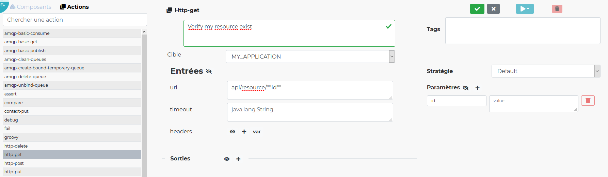
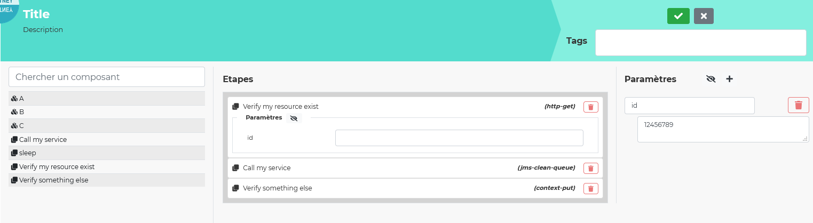

#  
## Spice up your spec , Better `taste` your app !

[](https://travis-ci.com/chutney-testing/chutney)
[](https://www.codacy.com/gh/chutney-testing/chutney?utm_source=github.com&amp;utm_medium=referral&amp;utm_content=chutney-testing/chutney&amp;utm_campaign=Badge_Grade)
[](https://codecov.io/gh/chutney-testing/chutney/)
[](https://app.fossa.com/projects/custom%2B8595%2Fgit%40github.com%3Achutney-testing%2Fchutney.git?ref=badge_shield)
[ ](https://bintray.com/chutney-testing/maven/chutney/_latestVersion)
[](https://chutney-testing.zulipchat.com/)

Chutney aims to test deployed software in order to validate functional requirements.

Chutney is released as a standalone application including a test execution engine, 
a web front end, and an edition server to create and edit your scenarios, consult test reports, and define your environments and test data.

Chutney scenarios are declarative. They provide functional requirements and technical details (needed for automation) in a single view. 

Those technical details are provided by generic [Tasks](https://github.com/chutney-testing/chutney/blob/master/task-spi/src/main/java/com/chutneytesting/task/spi/Task.java) such as HTTP, SOAP, AMQP, MongoDB, SQL, JMS, Kafka, Selenium, JSON, XML, etc.
Those Tasks are extensions and you can easily develop yours, even proprietary or non-generic one, and include them in your own release.

In addition, Chutney provide SpEL evaluation and extensible [Function](https://github.com/chutney-testing/chutney/blob/master/task-spi/src/main/java/com/chutneytesting/task/spi/SpelFunction.java) in order to ease the use of managing scenario data like JSON path or Date comparison.  

Currently, there are 2 ways of writing scenarios :
- json file 
    - [example](#json) 
    - [documentation (in french only)](ui/src/assets/doc/user_manual.adoc)
- Creating directly the step with ui. We called that composed scenario. 
    - [example](#component)

## Summary

* [Why another test tool ?](#why)
* [What is it not ?](#whatnot)
* [How to contribute ?](#contrib)
* [Team](#team)
    * [Contributors](#contributors)
* [Roadmap](#road)
    * [Project History](#story)
    * [En cours](#wip)
    * [Horizons](#horizon)
* [Example](#example)
    * [Json scenario example](#json)
    * [Composed scenario example](#component)
    
## <a name="why"></a> Why another test tool ?

Chutney is an opinionated test tool based upon the practice of Specification by Example. 

Chutney was inspired by Seb Rose blog post in which he revised the test pyramid according to test readability 
[The Testing Iceberg](http://claysnow.co.uk/the-testing-iceberg/)

Chutney is not exactly what Seb Rose meant by using this metaphore.

But we envisioned a tool allowing multiple levels of readability, providing a single place for business people, 
testers and developers to co-create, share and execute acceptance tests.

Moreover, we needed to :
* Promote and support Specification by Example across multiple teams and offices
* Ease collaboration and shared understanding in a "not so agile" environment
* Provide a single source of truth without hiding details in tests _glue code_
* Ease the automation of thousands of manual tests without writing and maintaining specific code
* Automate end-to-end tests of distributed software across secured networks, including hardware over telco networks 


-------------


## <a name="whatnot"></a> What is it not ?

__Chutney is not a replacement for tools like Cucumber, etc.__

While having some overlap, they all fill different test aspect.

The key difference is the absence of glue and support code.

While we think that having glue code is cumbersome and adds unnecessary levels of indirection between the features and the system under test,
especially for high level tests and distributed softwares.

We also do think that using Cucumber for low level testing is sometimes very handy and useful, 
thanks to the high level of expression provided by Gherkin (and this is part of the Testing Iceberg Seb Rose talked about).


__Chutney is no silver-bullet, it is just a tool which promotes and supports one way of doing software testing.__

As such, to benefit from it, we highly advise you to be proficient or to document yourself about 
Behaviour-Driven-Development (by Dan North), Specification by Example (by Gojko Adzic) and Living Documentation (by Cyrille Martraire).
All of which, however you call it, define the same practices and share the same goals.  

Global understanding of Test Driven Development and knowledge about Ubiquitous Language (from Domain Driven Design, by Eric Evans) 
is also valuable.


-------------


## <a name="contrib"></a> How to contribute ?


You don't need to be a developer to contribute, nor do much, you can simply:
* Enhance documentation,
* Correct a spelling,
* [Report a bug](#bug)
* [Ask a feature](#feat)
* Give us advices
* etc.

To help you start, we invite you to read:
* [Contributing](CONTRIBUTING.md), which gives you rules and code conventions to respect
* [Getting started](GETTING_STARTED.md), which document :
    * How to install and use Chutney as a User
    * How to install and setup the required environment for developing
* [Help Wanted](HELP_WANTED.md), if you wish to help us, but you don't know where to start, you might find some ideas in here !


To contribute to this documentation (README, CONTRIBUTING, etc.), we conforms to the [CommonMark Spec](https://spec.commonmark.org/)

-------------

## <a name="team"></a> Team

You can write to us at: https://chutney-testing.zulipchat.com/

Core contributors :
  * [Mael Besson](https://github.com/bessonm)
  * [Nicolas Brouand](https://github.com/nbrouand)
  * [Matthieu Gensollen](https://github.com/boddissattva)
  * [Loic Ledoyen](https://github.com/ledoyen)

### <a name="contributors"></a> Contributors

We strive to provide a benevolent environment and support any [contribution](#contrib).

Before going open source, Chutney was inner-sourced and received contribution from 30 persons:
- [David Dewalle](https://github.com/ddewalle)
- Abir Hammami
- [Yue Gao](https://github.com/yueshigao)


-------------

## <a name="road"></a> Roadmap

### <a name="story"></a> Project history

Project history can be seen in :
* [Change log file](CHANGELOG.md)

#### <a name="state"></a> Current State

Chutney is production ready, and we use it everyday.
Chutney has been successfully applied to ease the automation of hundreds of manual end-to-end tests without writing code.


### <a name="horizon"></a> Horizons

Chutney original vision strive to ease the collaboration of the 3 amigos (business people, testers and developers).

Over the past 2 years Chutney has diverge from our initial goals due to contextual reasons, but we learnt a lot on the way.

On the horizon we want to provide a custom and seamless experience to each profile of the 3 amigos.

## <a name="example"></a> Example
### <a name="json"></a> Json example

A scenario (withtout technical information) can be :

```
Given a user authentified
    HTTP call on authentication api
    Check authentication http OK
When the user try to do something
    HTTP call on my something service
    Check something http OK
Then verify something did something
    HTTP call to verify something is ok
        Retrieve data
        Verify data updated
```


With technical description (which can be executed by the engine): 
```
{
  title: Example scenario
  description: Make people want to use chutney
  givens:
  [
    {
      description: A user authentified
      subSteps:
      [
        {
          description: HTTP call on authentication api
          implementation:
          {
            type: http-post
            target: MY_APPLICATION_TARGET
            inputs:
            {
              timeout: 5 sec
              uri: /api/authentication
              headers:
              {
                Content-Type: application/json;charset=UTF-8
              }
              body:
              {
                login: ${#target.security().credential().get().username()}
                password: ${#target.security().credential().get().password()}
              }
            }
            outputs:
            {
              securityToken: ${#headers.get('x-auth-token').get(0)}
            }
          }
        }
        {
          description: Check authentication http OK
          implementation:
          {
            type: string-assert
            inputs:
            {
              document: ${#status.toString()}
              expected: "200"
            }
          }
        }
      ]
    }
  ]
  when:
  {
    description: the user try to do something
    subSteps:
    [
      {
        description: HTTP call on my something service
        implementation:
        {
          type: http-post
          target: MY_APPLICATION_TARGET
          inputs:
          {
            timeout: 5 sec
            uri: /api/service/something
            headers:
            {
              x-auth-token: ${#securityToken}
              Accept: application/json, text/plain, */*
              Content-Type: application/json;charset=UTF-8
            }
            body:
            {
              
            }
          }
          outputs:
          {
            id: ${#json(#body, '$.id')}
          }
        }
      }
      {
        description: Check something http OK
        implementation:
        {
          type: string-assert
          inputs:
          {
            document: ${#status.toString()}
            expected: "200"
          }
        }
      }
    ]
  }
  thens:
  [
    {
      description: Verify something did something
	  strategy:
	  {
		type: retry-with-timeout
		parameters:
		{
		  retryDelay: 5 sec
		  timeOut: 1 min
		}
	  }
      subSteps:
      [
        {
          description: HTTP call to verify something is ok
          subSteps:
          [
            {
              description: Retrieve data
              implementation:
              {
                type: http-get
                target: MY_APPLICATION_TARGET
                inputs:
                {
                  timeout: 15 sec
                  uri: /api/data/${#id}/something?action=TEST
                  headers:
                  {
                    x-auth-token: ${#securityToken}
                    Content-Type: application/json;charset=UTF-8
                  }
                }
                outputs:
                {
                  data: ${#json(#body, '$.[0].data').toString()}
                }
              }
            }
            {
              description: Verify data updated
              implementation:
              {
                type: string-assert
                inputs:
                {
                  document: ${#data}
                  expected: EVERYTHINGISOK
                }
              }
            }
          ]
        }
      ]
    }
  ]
}
```

### <a name="component"></a> Composed scenario

#### Create components
 

#### Create composed scenario
 
